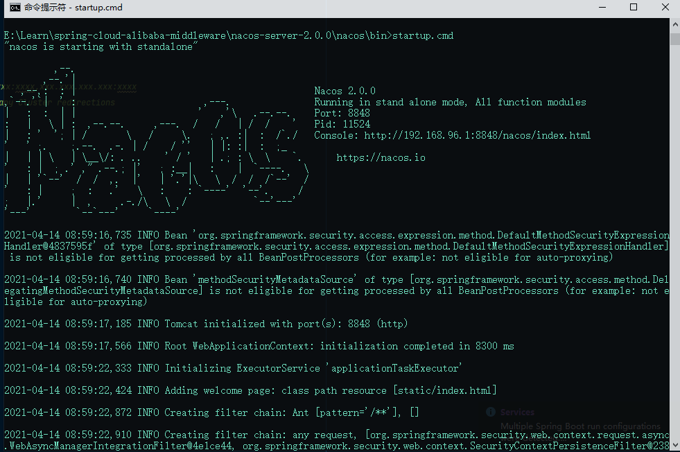
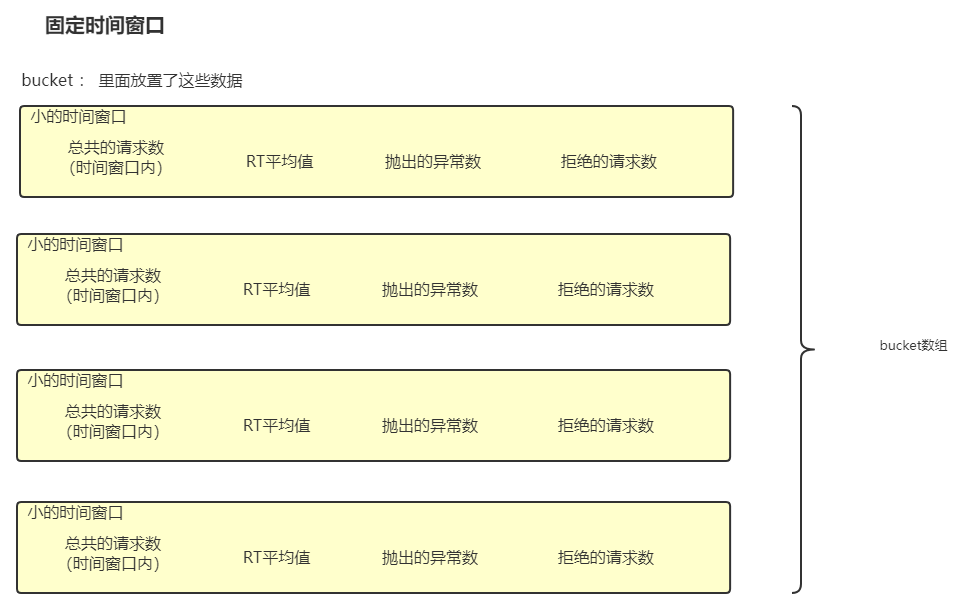
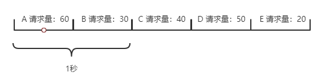
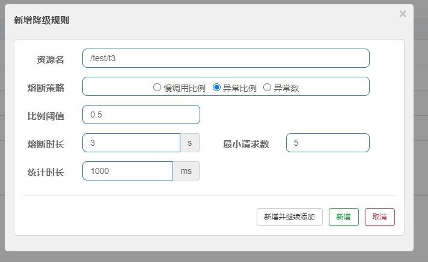

# Spring Cloud Alibaba

## 组件

- Sentinel: 流量控制
- Nacos: 服务注册中心，配置中心
- RocketMQ
- Dubbo
- Seata: 高性能微服务分布式事务
- Alibaba Cloud ACM
- Alibaba Cloud OSS
- Alibaba Cloud SchedulerX
- Alibaba Cloud SMS

## Nacos

与Euraka不同的是，Nacos既可以作为服务注册中心，又可以作为配置中心。而且使用Nacos时是将官方提供的服务运行起来即可， 不需要我们手写一个Eureka的服务注册中心来等待服务注册。

### 使用

我们需要去git上下载Nacos [download](https://github.com/alibaba/nacos/releases) 。Windows的话下载`.zip`的版本，解压到本地即可。 运行的话，在nacos的`/bin`
目录下由对应的cmd脚本。如果是自己学习的话记得编辑`startup.cmd`,将启动模式改为`standalone`,默认是`cluster`（集群模式）。 启动成功的界面如下：

启动之后访问[localhost]()

### 注册中心

1. Nacos作为注册中心，

### 配置中心

## Sentinel

### 核心：基于平滑时间窗口的降级

首先介绍一下时间窗口的概念：如果我们要实行基于QPS的限流策略，那么我们就得确定每一秒内的请求数是否超过了阈值，由于时间是连续的，我们查看请求数量时是查看的某个时间段的数据。
查看的这个时间段就是认为是一个窗口，我们通过这个时间窗口来看连续的时间。

使用`bucket`来维持时间窗口内的数据，当请求打进来时，就去对应的数据位修改值。  
统计分钟使用的是一个`bucket[]`，一个`bucket`统计500ms,那么1分钟的数据需要120个`bucket`来进行统计。 另外，全局只维持一个bucket的数组，是通过`取模`操作来不断复用数组。

- 固定时间窗口：自服务启动时，按照固定时间单位划分时间窗口，查看是否请求是否需要限流就看每个固定时间内的请求总数是否超过了阈值。
  

  每个时间窗口都用一个`bucket`来维护数据，可以通过一个枚举类，来指定桶内的数据位的含义。但是这种时间窗口有个问题：
    1. 时间是成段的，并不连续，从时间段分布上来看是囊括了整个时间轴的，但是整个时间窗口是作为一个独立的点存在的。
       比如说要求QPS需要限制在100，第1秒的前0.5秒内QPS有20，后0.5秒内QPS有70，在这一秒内是满足流量限制的。如果下一秒的前半秒内的QPS达到了50，
       后0.5秒内QPS为30，看起来下一秒也没有达到流量阈值。但是在中间的一秒，流量达到了120，明显超出了流量的限制。因此固定时间窗口的不平滑会导致 某个时间段内流量超限。

- 平滑时间窗口：理想的平滑时间窗口应该是每次请求查看是否超过阈值时都以当前请求时间为基准，向前查询一个时间周期的请求数，但是这样会频繁计算请求数，耗费大量的计算资源。
  限流的目的是限制流量过多导致资源不够用，而不是盲目拦截请求而加大计算。`Sentinel`在固定时间窗口的基础上进行了优化，设定每500ms作为一个小的时间窗口，每次检查
  流量是否超限时就查看当前时间窗口及上一个时间窗口内的请求总数是否达到了阈值。
  
  每次请求来的时候，查看上一个时间窗口的请求总数+当前时间窗口请求总数的和，如果加起来超过了阈值，那么就将多余的请求进行降级处理或者分发到下一个时间周期内。
  其实还会存在固定窗口存在的问题，将时间窗口划分的越小越平滑，但是同时也会提高计算的复杂度。

### 限流规则

- 限流是限制所有请求访问，是无状态的
- 如果是限制`用户`的方法，比如说限制某个用户的访问次数，这个更像是拒绝策略，手段是可以在redis中设置用户的计数器，每次该用户的请求进来时计数器+1 限流方式：
    1. 网关限流：所有请求通过网关进行限流，比如说对某个API的并发量要求是100，那么在网关层对该API进行拦截，超过100就走降级方法。这样做不会管每个节点能承受多少流量，只关心有多少流量能到API上。这种方法限制的是网络资源，主要是看网卡的吞吐量
    2. 服务限流：每个节点记录

### 降级规则

- RT:如果超过设定的响应时间，则会在一个`时间窗口`的周期内不响应请求。
- 异常比例：我们可以看一下在`dashboard`设定的异常比例降级规则的界面
  
    - 比例阈值：异常比例降级的阈值，即异常响应数和全部请求的比值
    - 熔断时长：触发降级机制之后，进行熔断的时间长度
    - 最小请求数： 统计异常比例时记录的请求总数的最小值
    - 统计时长：统计异常比例的时间段
- 异常数

### 系统保护规则

- LOAD: CPU数与线程数的一个比值（一段时间内的平均结果） 限制计算资源
- RT(Response Time) [BBR]: 限制网络资源
- 线程数:
- 入口QPS
- CPU使用率

### 集群流控

1. 均摊（设置总数，分摊到集群中的每个节点上）：这里随着节点的上下线，每个节点所分摊的流量限制会变化，所以当大量节点下线了，剩余的节点可能会承受较大压力
2. 总体流控（所有节点接受请求的和不超过阈值）：这里根据负载均衡算法来将请求分摊到每个节点上，然后监控所有节点的流量和
3. 定向流量分发（比如IPHash）：可以根据不同请求值将流量分发到不同集群中

## dashboard

一个监控服务的控制台，我们可以在这里设置服务限流的规则，也可以监控服务当前的健康状态。  
注： 如果在Sentinel中配置了服务限流规则，则会与dashboard中配置的存在冲突，两者会有一个失效。  
dashboard服务的文档地址 [dashboard](https://github.com/alibaba/Sentinel/wiki/Dashboard)  
dashboard的jar包地址 [download](https://github.com/alibaba/Sentinel/releases)

下载jar包之后需要运行jar包，运行命令如下：
> java -Dserver.port=8080 -Dcsp.sentinel.dashboard.server=localhost:8080 -Dproject.name=spring-cloud-alibaba -jar sentinel-dashboard.jar

在运行jar的时候有几个JVM的参数需要注意：

- Dserver.port=8080 : Spring Boot的参数， 用于指定 Spring Boot 服务端启动端口为 `8080`
- Dcsp.sentinel.dashboard.server=localhost:8080 : 向 Sentinel 接入端指定控制台的地址
- Dproject.name=spring-cloud-alibaba : 向 Sentinel 指定应用名称，比如上面对应的应用名称就为 sentinel-dashboard

