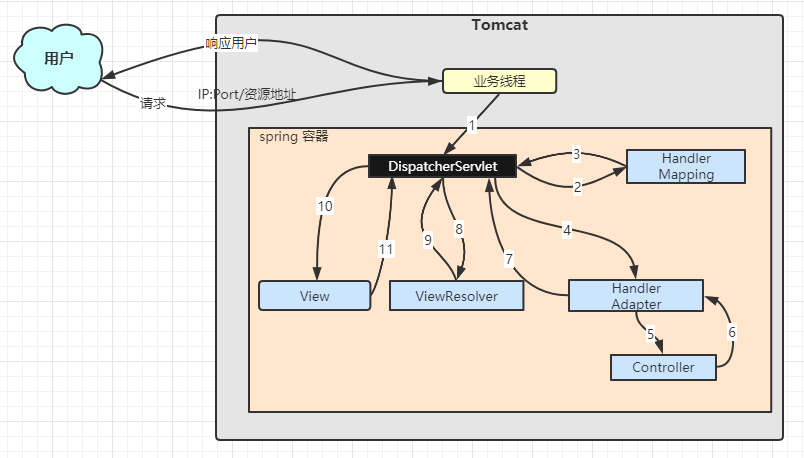

# Spring MVC

## DispatcherServlet
Spring MVC是如何将前端的请求分配到指定的Controller中的？  

### 组件
- DispatcherServlet
- HandlerMapping
- HandlerAdapter
- Controller
- ViewResolver
- View
### 流程：
1. 用户请求打到`DispatcherServlet`上
2. `DispatchServlet`根据请求查询`HndlerMapping`
3. 返回处理器执行链`handlerExecutionChain{...}` 
4. 执行`handler`
5. `HandlerAdapter`将不同的handler分给对应的Controller （）
6. 执行之后，返回`ModelAndView`
7. 返回`ModelAndView`
8. 交给`ViewResolver`解析视图
9. 返回`View`对象
10. 渲染视图（这里应该是根据View的值去填充JSP或者前端的数据）
11. 返回视图  

> 总结： 
> 1. 用户请求交给DispatcherServlet,DispatcherServlet从HandlerMapping中获取处理器执行链
> 2. DispatcherServlet根据handler找到对应的Controller，将控制权交给Controller
> 3. Controller内部完成请求的数据模型的创建和业务逻辑的处理，然后再将填充了数据后的模型即model和控制权一并交还给DispatcherServlet，委派DispatcherServlet来渲染响应。
> 4. DispatcherServlet再将这些数据和适当的数据模版视图结合，向Response输出响应。

